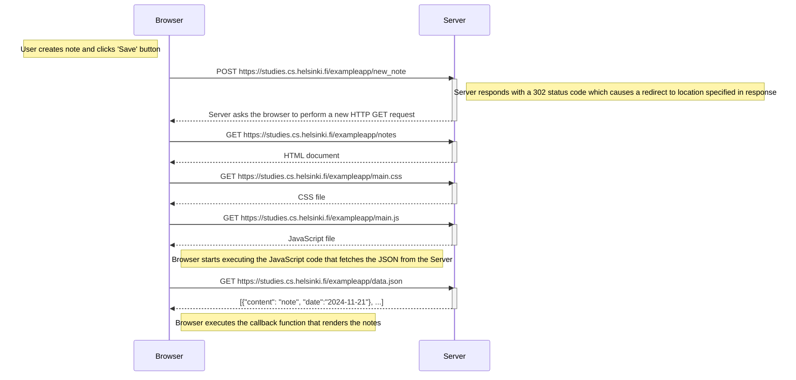

```mermaid
sequenceDiagram
  participant Browser
  participant Server
  Note left of Browser: User creates note and clicks 'Save' button
  Browser->>Server: POST https://studies.cs.helsinki.fi/exampleapp/new_note
  activate Server
  Note right of Server: Server responds with a 302 status code which causes a redirect to location specified in response
  Server-->>Browser: Server asks the browser to perform a new HTTP GET request
  deactivate Server
  Browser->>Server: GET https://studies.cs.helsinki.fi/exampleapp/notes
  activate Server
  Server-->>Browser: HTML document
  deactivate Server
  Browser->>Server: GET https://studies.cs.helsinki.fi/exampleapp/main.css
  activate Server
  Server-->>Browser: CSS file
  deactivate Server
  Browser->>Server: GET https://studies.cs.helsinki.fi/exampleapp/main.js
  activate Server
  Server-->>Browser: JavaScript file
  deactivate Server
  Note right of Browser: Browser starts executing the JavaScript code that fetches the JSON from the Server
  Browser->>Server: GET https://studies.cs.helsinki.fi/exampleapp/data.json
  activate Server
  Server-->>Browser: [{"content": "note", "date":"2024-11-21"}, ...]
  deactivate Server
  Note right of Browser: Browser executes the callback function that renders the notes
```
