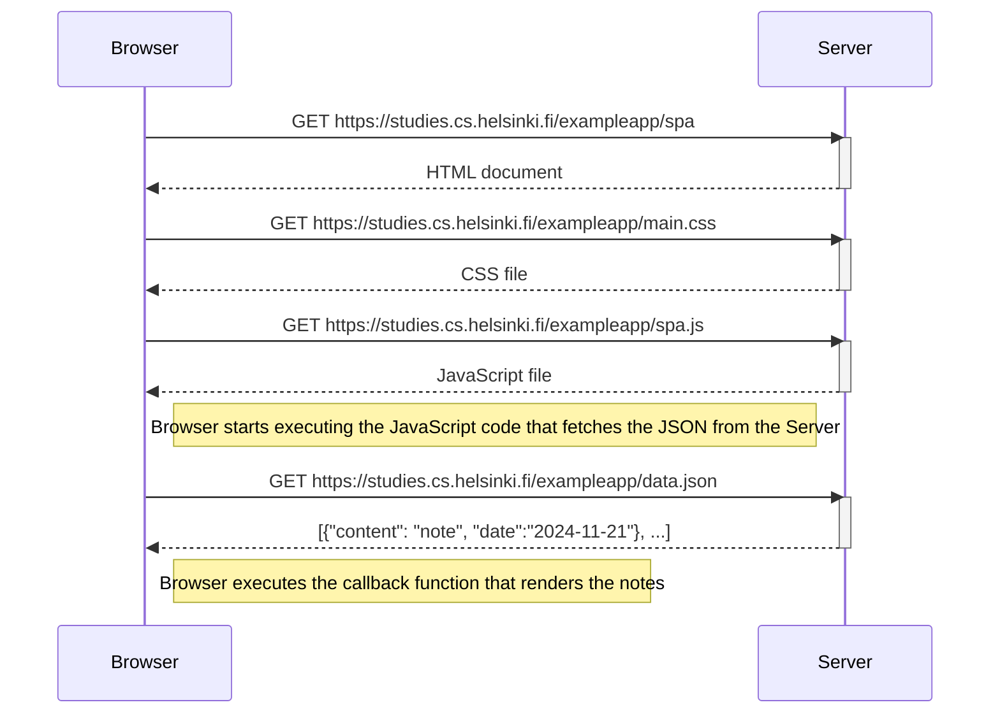

```mermaid
sequenceDiagram
  participant Browser
  participant Server
  Browser->>Server: GET https://studies.cs.helsinki.fi/exampleapp/spa
  activate Server
  Server-->>Browser: HTML document
  deactivate Server
  Browser->>Server: GET https://studies.cs.helsinki.fi/exampleapp/main.css
  activate Server
  Server-->>Browser: CSS file
  deactivate Server
  Browser->>Server: GET https://studies.cs.helsinki.fi/exampleapp/spa.js
  activate Server
  Server-->>Browser: JavaScript file
  deactivate Server
  Note right of Browser: Browser starts executing the JavaScript code that fetches the JSON from the Server
  Browser->>Server: GET https://studies.cs.helsinki.fi/exampleapp/data.json
  activate Server
  Server-->>Browser: [{"content": "note", "date":"2024-11-21"}, ...]
  deactivate Server
  Note right of Browser: Browser executes the callback function that renders the notes
```
