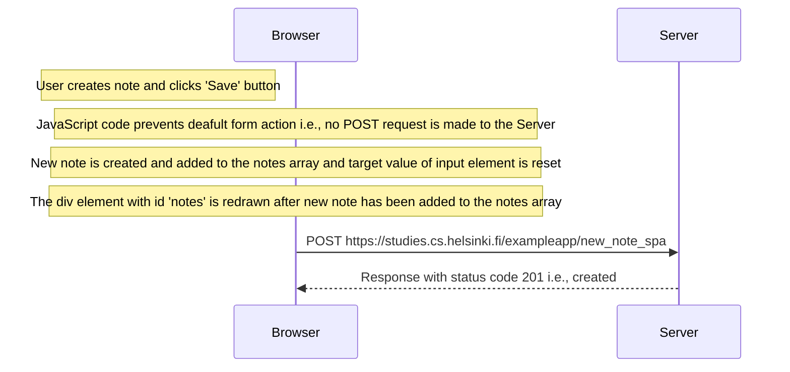

```mermaid
sequenceDiagram
  participant Browser
  participant Server
  Note left of Browser: User creates note and clicks 'Save' button
  Note over Browser: JavaScript code prevents deafult form action i.e., no POST request is made to the Server
  Note over Browser: New note is created and added to the notes array and target value of input element is reset
  Note over Browser: The div element with id 'notes' is redrawn after new note has been added to the notes array
  Browser->>Server: POST https://studies.cs.helsinki.fi/exampleapp/new_note_spa
  Server-->>Browser: Response with status code 201 i.e., created
```
